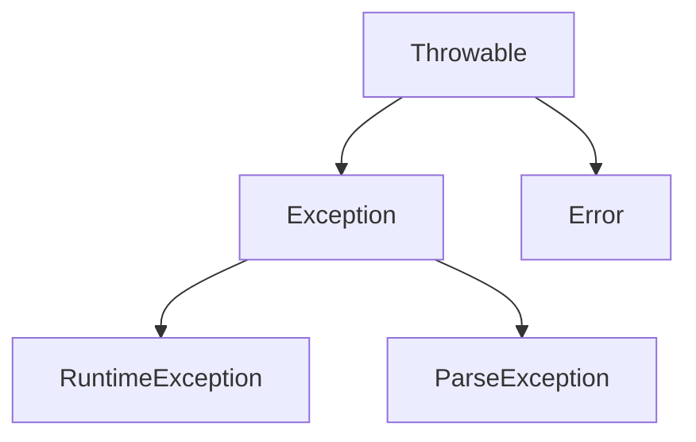

# 异常的概述和体系结构
- Java中使用Exception类来描述异常

- **Throwable**
    - **Error**: 错误，一般不要去掩盖，让其充分暴露，然后才能找到出错的地方加以修正
    - **Exception**: 异常，可以做一些捕获
        - **RuntimeException**: **运行时异常**，编译的时候能通过，运行的时候报出了异常，此种异常通常是由用户的操作而造成的，很多时候不可避免
            - 运行时异常的处理方式：
                1. 不处理
                2. 使用**try catch**结构，为了让后面的程序可以继续运行
        - **ParseException**: **编译期异常**，无法通过编译的异常，是为了提示开发者，请开发者注意一下这个地方可能会出错
            - 编译期异常的处理方式
                1. 同样可以使用**try catch**结构，检查以后发现这个错误是不可预期的，这个时候就可以用**try catch**结构，保证后面的程序可以继续运行
                2. 使用**throws**语句，检查之后发现程序完全没有问题，为了通过编译，就使用**throws**将异常抛出以通过运行

---

# JVM处理异常的方式和try catch处理异常
- JVM默认的处理异常的方式
    - 将异常的位置、信息、原因输出到控制台，然后直接终止程序
- try catch处理异常
    - 格式：
    ```java
    try {
        可能会出现异常的语句体;
    } catch (异常类型 变量名) {
        发现异常后执行的语句体;
    }
    ```
    - 经过try catch处理的代码，如果try里的代码出现了异常，try catch后面的代码还是会继续执行

---
# 如何处理多个异常
- 使用多个catch，每一个catch中写一种异常
- 使用一个catch，放多种异常，但每个异常之间需要用或"&#124;"隔开

---
# Throwable的常用方法
```java
String getMessage()         //返回此throwable的详细消息字符串
String toString()           //返回此throwable的简短描述
void printStackTrace()      //打印异常的堆栈的跟踪信息
```

---
# 自定义异常
- 根据实际中不同的需求，去额外的再去定义一些异常
    - 根据需要的异常的类型，去选择异常的父类，再继承就好了
```java
class AgeOutOfBoundsException extends RuntimeException{
    public AgeOutOfBoundsException(){

    }
	public AgeOutOfBoundsException(String messege){
	    super(messege);
	}
}
```
---
# finally的概述和应用场景
- finally是一个关键字，和try catch一起使用，最终肯定会被执行
- 用于做一些程序的收尾工作(例如流的关闭)
- 注意事项：
    - 如果catch里有return语句，finally中的代码仍然会被执行，而且是在return执行时执行
        - return执行时会先将语句进入内存中，此时执行finally中的语句，在执行完finally的语句之后，如果程序还没有结束(finally中可能有return语句)，则执行事先存入内存中的return语句

---
# 一些关键词的区别
- final finally finalize的区别
    - final
        - 是一个修饰符
            - 修饰的变量时常量
            - 修饰的方法不能被重写
            - 修饰的类不能被继承
    - finally
        - 是一个关键字，和try catch一起使用，最终肯定会被执行
    - finalize
        - 是一个方法名，是Object的一个方法，当垃圾回收器回收一个对象的时候，就会自动去执行这个对象的finalize方法

---
