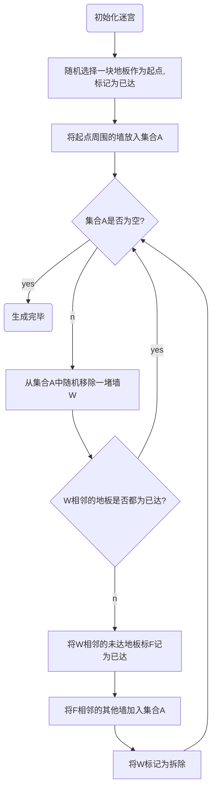

# Prim算法与迷宫

> 迷宫（希腊语：λαβύρινθος，拉丁转写：labyrinthos）指的是充满复杂通道，很难找到从其内部到达入口或从入口到达中心的道路，道路复杂难辨，人进去不容易出来的建筑物。通常比喻复杂艰深的问题或难以捉摸的局面。

## 简介

**普里姆算法**（Prim算法），图论中的一种算法，可在加权连通图里搜索最小生成树。意即由此算法搜索到的边子集所构成的树中，不但包括了连通图里的所有顶点（英语：Vertex (graph theory)），且其所有边的权值之和亦为最小。该算法于1930年由捷克数学家沃伊捷赫·亚尔尼克（英语：Vojtěch Jarník）发现；并在1957年由美国计算机科学家罗伯特·普里姆（英语：Robert C. Prim）独立发现；1959年，艾兹格·迪科斯彻再次发现了该算法。因此，在某些场合，普里姆算法又被称为DJP算法、亚尔尼克算法或普里姆－亚尔尼克算法。

> 以上摘抄自[百度百科](https://baike.baidu.com/item/Prim/10242166)

## Prim与迷宫

百科的介绍术语比较多，显得有些难懂，换一个简单的方式来介绍Prim算法的话，就得提到迷宫了。

小时候杂志报纸上经常见到的迷宫游戏，假如要自己来做一个的话，要如何下手呢？

实现方面需要考虑如何向程序描述迷宫的格子和墙。

迷宫方面还需要有如下的考虑：

1. 生成的迷宫不能有闭塞区域(所有的格子都应当是可到达的)
2. 算法是随机生成的(算法每次生成的迷宫不能一样)
3. 墙要尽可能多
4. ……

现在重新审视一遍迷宫：

迷宫中，可以将每一个地板格子看成是一个节点，而相邻地板之间的“墙”，就是连接节点的“边”。我们生成迷宫，就是要把所有的地板都走遍，并且打穿的墙要尽可能的少。

而Prim算法中，作为输入的加权连通图，指的是节点与边的一个集合。Prim所要做的事情是搜索出一个“树”，即输入的总图的一个子集。这个子集需要包括所有的节点，而且边的权重之和最小。在迷宫的问题当中，不存在所谓边的权重，可看做每个边(墙)的权重都相等。

基于这些，再重新看一遍Prim算法：

**可在大地图中生成迷宫地图。意即由此算法搜索到的地图格子集合中，不但包括了大地图里的所有格子，且其所生成的墙也为最多。**

## 具体步骤

Prime迷宫生成算法：

## 附

- [python代码](https://nbviewer.jupyter.org/url/curatorjin.github.io/blog/assets/ipynb/Prime2Gif.ipynb)

- 生成过程的gif：

   

