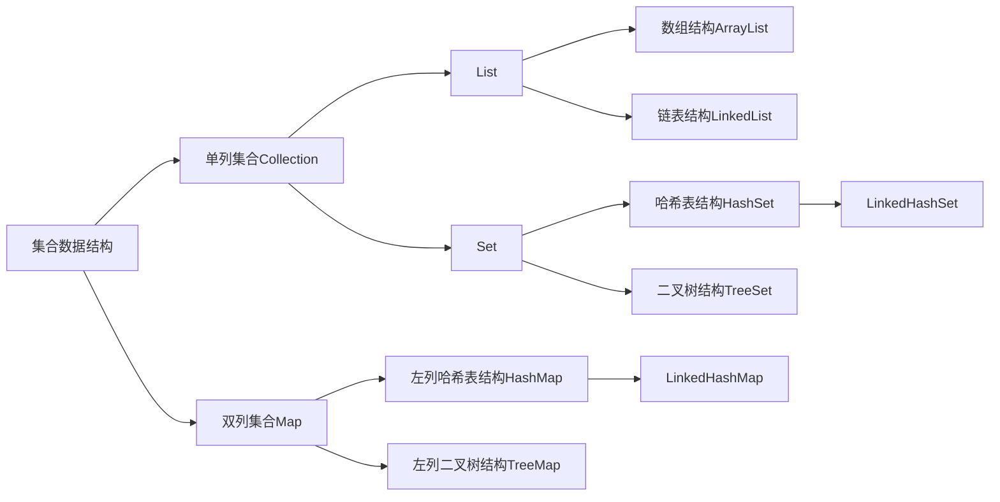

# 集合的体系结构
- 由于不同的数据结构(数据的组织、存储方式)，Java为我们提供了不同的集合，但不同的集合的功能都是相似的，都实现了同一个Collection接口

- 分析体系结构从最顶层开始，其包含了所有的共性
- 使用时从最底层开始，其即为具体的实现


---
# Collection中的常用功能
- **boolean add(Object o)**: 向集合中添加元素
    - 由于List允许其中的元素重复，所以调用时总是会返回true
    - 同样的，在Set中不允许元素重复，所以调用时未必会返回true
- **void clear()**:清空集合中所有元素
- **boolean contains(Object o)**:判断集合中是否包含某个元素
- **boolean isEmpty()**:判断集合中的元素是否为空
- **boolean remove(Object o)**:根据元素的内容来删除某个元素
- **int size()**:获取集合的长度
- **Object[] toArray()**:能够将集合转换成数组并把集合中的元素存储到数组中

---
# 迭代器的概述和测试
- 集合的遍历方式
    - 调用 **toArray()** 方法，可以把集合转换成数组，然后遍历数组即可
    - 调用 **iterator()** 方法，返回一个迭代器对象
- Iterator：迭代器，可以用于遍历集合
    - Iterator是一个==接口==，无法直接创建对象，需要通过集合的方法来创建
    - Iterator的常用方法：
        ```java
        Object next()                                               //返回下一个元素
        boolean hasNext()                                           //判断是否有下一个元素可以获取

        //使用案例：
        public class IteratorDemo{
            public static void main(String[] args){
                Collection<Integer> list = new ArrayList<>();
                list.add(1);list.add(14);list.add(2);list.add(12);  //创建测试用集合

                Iterator it = list.iterator();                      //创建迭代器对象
                while(it.hasNext()){
                    System.out.println(list.next();                 //使用迭代器遍历集合
                }
            }
        }
        ```
        - 当迭代器中没有下一个元素可以获取，即hasNext()的值为false时，再调用next()方法会出现**NoSuchElementException**异常
        - **注意**：由于Iterator的next()方法会将迭代器的光标向后移动一位，所以==遍历时的每次循环中只能调用一次next方法==

---
# 并发修改异常
- java.util.ConcurrentModificationException
- 迭代器依赖于集合，相当集合的一个副本，迭代器在操作时如果发现与集合长度不一样，则会抛出异常
- 解决方案
    - 在使用迭代器进行遍历时，使用迭代器本身去修改，迭代器会自行同步集合
- 用迭代器去修改集合
    - 删除
        - Collection可以实现，调用remove()方法
    - 添加
        - 只有List集合才可以
            - 调用ListIterator迭代器(List体系特有的迭代器)
            - ListIterator中既有remove()方法，也有add()方法

---
# 泛型&增强for循环
- 泛型
    - 广泛的类型，需要创建对象或者调用方法的时候明确
    - 优点
        - 把运行期的错误提前到了编译期
        - 去除了程序中的warning
        - 不需要强制类型转换
- 增强for循环
    ```java
    for(数据类型 变量名:集合或数组){
        语句体
    }
    ```
    - 只要是Iterable的子类都可以用增强for循环来遍历

---
# 常见数据结构(数组)
- 特点：查询快，增删慢
- 举例：ArrayList，其底层为数组结构

---
# 常见数据结构(链表)
- 特点：查询慢，增删快
- 举例：LinkedList，其底层为链表结构

---
# 常见数据结构(栈&队列)
- 栈
    - 特点：先进后出
    - 举例：Stack，其底层为栈的数据结构
- 队列
    - 特点：先进先出
    - 举例：无

---
# List的特点和特有功能
- 特点
    - 有序
    - 可以重复
    - 有索引
        - 链表的索引是“假索引”，底层操作时仍然是遍历查找
- 增删改查
```java
void add(int index, E e);   //在指定索引位置插入元素e
E remove(int index);        //移除指定索引位置的元素并将其返回
E set(int index, E e);      //将指定索引处的元素改为元素e,并将覆盖的元素返回
E get(int index);           //返回指定索引处的元素
```
- 功能性的方法，离不开增删改查
```java
int indexOf(Object o);          //返回此列表中第一次出现的指定元素的索引；如果此列表不包含该元素，则返回-1
boolean contains(Object o);     //如果列表包含指定的元素，则返回 true,否则为false
```

---
# List的子类概述和LinkedList的特有功能
- LinkedList：
    - 特有方法都是和首尾有关的
    ```java
    void addFirst(E e);     //向链表的头部添加元素
    void addLast(E e);      //向链表的尾部添加元素
    E getFirst();           //获取链头的元素,不删除元素
    E getLast();            //获取链尾的元素,不删除元素
    E removeFirst();        //返回链头的元素并删除链头的元素
    E removeLast();         //返回链尾的元素并删除链尾的元素
    ```

---
